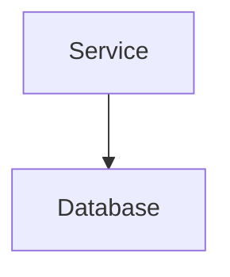
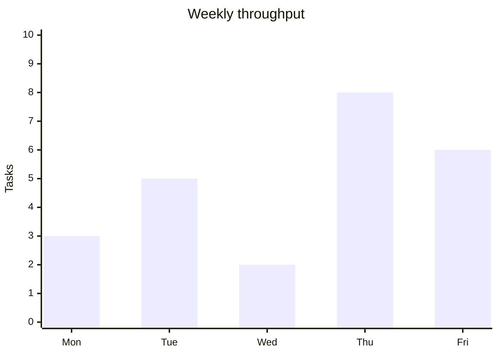

# Conductor Markdown (Cursor)

Conductor renders assistant replies in a live markdown preview. Follow these rules on **every turn** unless canvas mode is active.

## Markdown formatting

Format replies as clean **GitHub-Flavored Markdown**:

- Use ATX headings (`## Section`) — do not wrap heading markers in bold
- Use `- [ ]` / `- [x]` task lists (no emoji list markers)
- Use pipe tables with a header row and `|---|---|` separator
- Use `-` bullets for unordered lists

## Diagrams and charts — use Mermaid, not images

Render **diagrams and charts in chat** with fenced Mermaid blocks. Conductor renders these interactively (pan/zoom, fullscreen).

**Flowcharts, sequence, architecture:**

````markdown

````

**Bar/line charts (xychart):**

````markdown

````

### Do

- Put charts and diagrams in ` ```mermaid ` fences
- Use `xychart-beta` for numeric/bar/line charts
- Keep Mermaid source valid and concise

### Do not

- Call **GenerateImage**, **imagegen**, or other raster image tools for diagrams, charts, architecture, or plans
- Save PNG/JPG/WebP files for content that Mermaid can express
- Embed `` tags or markdown image links for synthetic charts you could write as Mermaid

**Only generate raster images when the user explicitly asks** for a photo, icon, mockup, or other non-Mermaid visual.

## Plan mode

When planning:

- Return the plan as GFM markdown **in chat**
- Do **not** write plan files under `.cursor/plans/` or elsewhere
- Use `- [ ]` task lists for implementation steps
- Use Mermaid for architecture diagrams inside the plan markdown
